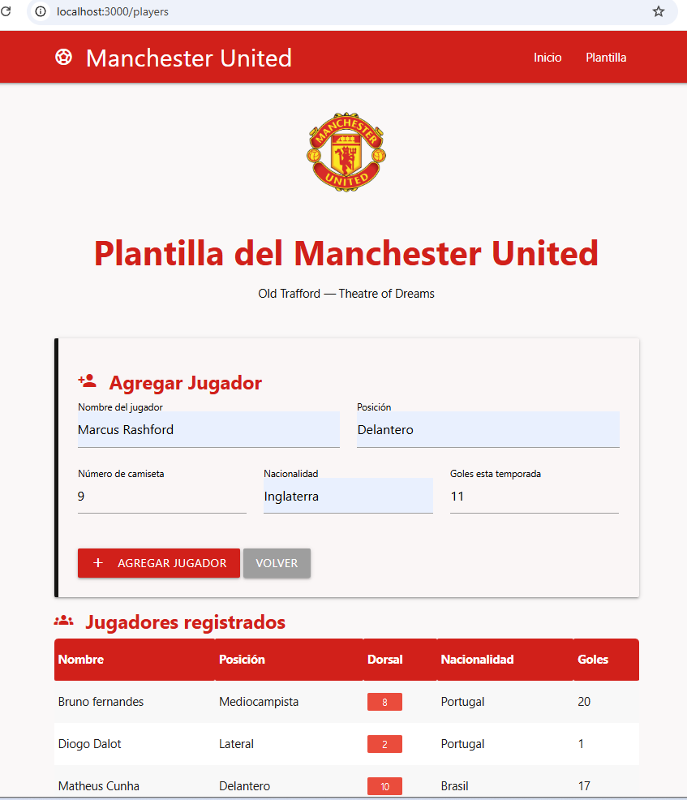

# Lab 04 - Sitio Web con Express
Sitio web de registro de jugador del Manchester United hecho con Express, EJS y Materialize CSS.

## Estudiante
Kevin Quispe - Tecsup

## Contenido

- **Inicio y Acerca de**: páginas base del sitio.
- **Contacto**: formulario que guarda mensajes en memoria y los muestra en /admin.
- **Error 404 personalizado**: vista propia cuando la ruta no existe.
- **Plantilla Manchester United**: vista libre con formulario y tabla para registrar jugadores (nombre, posición, dorsal, nacionalidad, goles), hecha con Materialize.

## Estructura
├── app.js
├── controllers/
├── routes/
├── views/
└── public/

